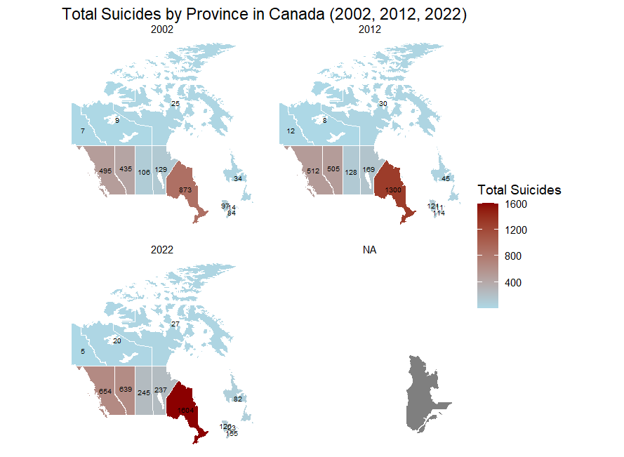

# Mental Health and Suicide Trends Analysis in Canada (2002–2022)

## Overview

This project examines **mental health trends, suicide rates, and socio-economic factors** in Canada over two decades (2002–2022). Using **exploratory data analysis (EDA) and machine learning models**, the study aims to identify high-risk groups and provide actionable insights.

## Key Features

-   **Exploratory Data Analysis (EDA):** Identifying trends in mental health indicators and suicide rates by demographics (age, gender, province).
-   **Machine Learning Models:**
    -   **Logistic Regression:** Achieved **80% accuracy** in predicting suicidal thoughts.
    -   **Random Forest:** Performed with **77.78% accuracy**.
    -   **Support Vector Machine (SVM):** Achieved **60% accuracy**.
-   **Interactive Dashboard:** A **Shiny web application** for visualizing mental health and suicide trends.

------------------------------------------------------------------------

## Key Findings

### **1. Relationship Between Inflation and Suicidal Thoughts**

-   Inflation Rate has a strong relationship with suicidal thoughts:
    -   **Inflation rate is highly correlated with:**
        -   **Suicidal thoughts, life** (r = **0.9759**, p = **0.1400**)
        -   **Suicidal thoughts, 12 months** (r = **0.9727**, p = **0.1491**)

### **2. Mental Health Indicators and Suicidal Thoughts Correlation**

| Indicator | Suicide Indicator | Correlation | t-value | p-value |
|----|----|----|----|----|
| Major depressive episode, life | Suicidal thoughts, life | 1.000 | 38.093 | 0.0167 |
| Eating disorder, current diagnosed condition | Suicidal thoughts, life | 0.988 | 6.397 | 0.0987 |
| Generalized anxiety disorder, life | Suicidal thoughts, life | 0.824 | 1.452 | 0.3840 |
| Bipolar disorder, life | Suicidal thoughts, life | 0.824 | 1.452 | 0.3840 |
| Major depressive episode, life | Suicidal thoughts, 12 months | 1.000 | 83.325 | 0.0076 |
| Eating disorder, current diagnosed condition | Suicidal thoughts, 12 months | 0.986 | 5.850 | 0.1078 |
| Generalized anxiety disorder, life | Suicidal thoughts, 12 months | 0.815 | 1.409 | 0.3930 |
| Bipolar disorder, life | Suicidal thoughts, 12 months | 0.815 | 1.409 | 0.3930 |

------------------------------------------------------------------------

## Research Questions

### **1. Descriptive Analysis**

-   How have **mental health indicators** changed over time (2002, 2012, 2022) across **age, province, and gender**?
-   What are the **trends in suicide rates** over 20 years, overall and by demographic groups?
-   Are there **provincial differences** in mental health disorders and suicide rates?
-   How have **inflation and CPI trends** varied across provinces?

### **2. Inferential Analysis & Hypothesis Testing**

-   Is there a **statistically significant** relationship between mental health disorders and suicide rates?
-   Do **certain demographic groups** have significantly higher suicide rates?
-   How have **inflation (CPI) and economic conditions** impacted suicide rates and mental health disorders?

### **3. Predictive Analysis**

-   Can we **predict high-risk groups** for suicide using mental health and economic indicators?
-   Which **mental health disorders** have the strongest correlation with suicide rates?
-   Which **machine learning model** (Random Forest, SVM, Logistic Regression) performs best for suicide risk prediction?
-   What are the most influential **factors (mental health, economic, demographic) in suicide risk**?

------------------------------------------------------------------------

## Data Sources

| **Source** | **Dataset** | **Link** |
|----|----|----|
| Government of Canada | Mental health indicators (2002–2022) | [StatCan Table 13-10-0465-01](https://open.canada.ca/data/dataset/a9863f45-6a1a-4277-ae0f-2d9cb61d413a/resource/2caa55d4-370c-41bc-a662-5ee67da3c074) |
| Government of Canada | Consumer Price Index (CPI) | [Statistics Canada](https://www150.statcan.gc.ca/t1/tbl1/en/tv.action?pid=1810000401) |
| WHO | Global Suicide Rates | [WHO Global Health Data](https://www.who.int/data/gho) |

------------------------------------------------------------------------

## Methodology

### **Machine Learning Models**

| **Model** | **Accuracy** | **Purpose** |
|----|----|----|
| **Logistic Regression** | **80%** | Binary classification for **suicide risk prediction** |
| **Random Forest** | **77.78%** | Identifying **feature importance and non-linear relationships** |
| **SVM (Support Vector Machine)** | **60%** | Detecting complex patterns in **suicide risk classification** |

------------------------------------------------------------------------

## Snapshot

## Author

**Felix Vo**
